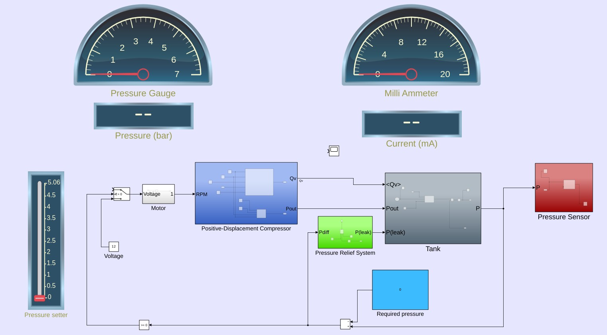
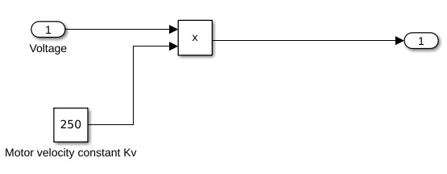
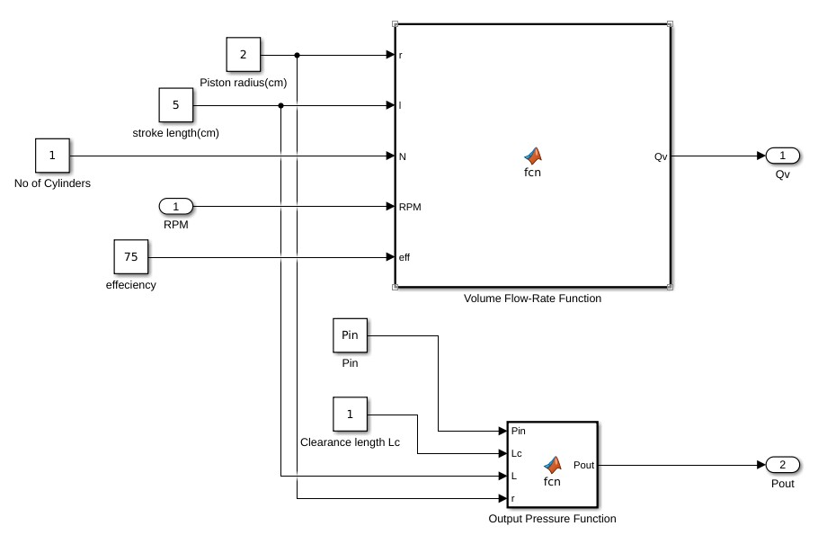
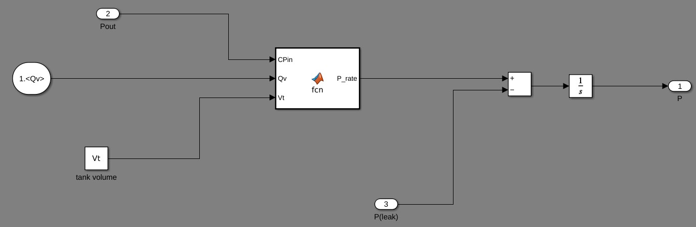
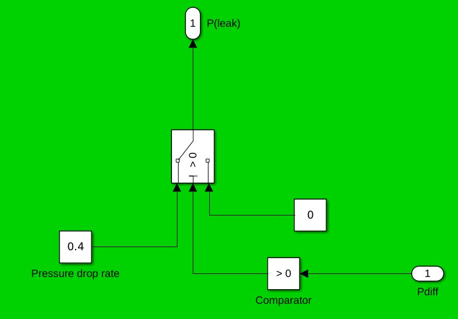
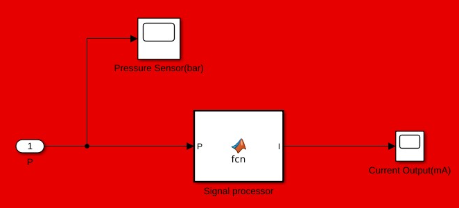
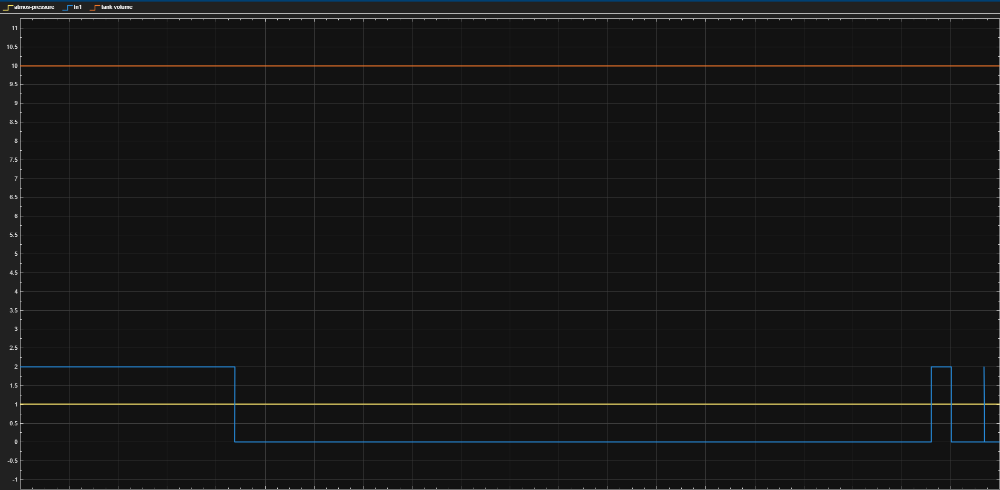
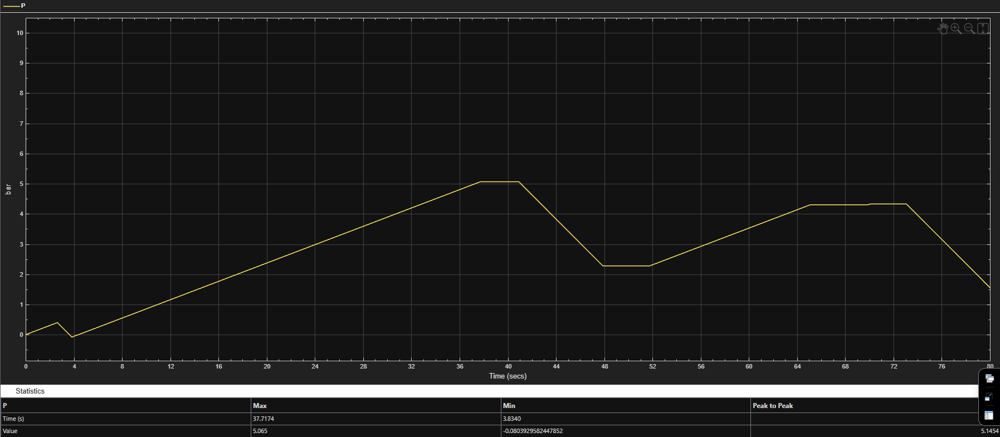
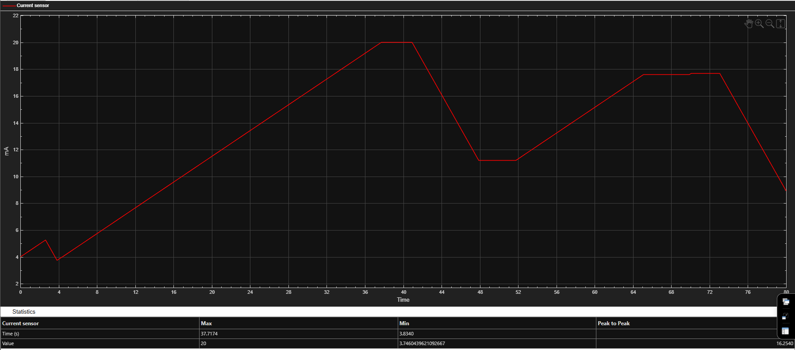
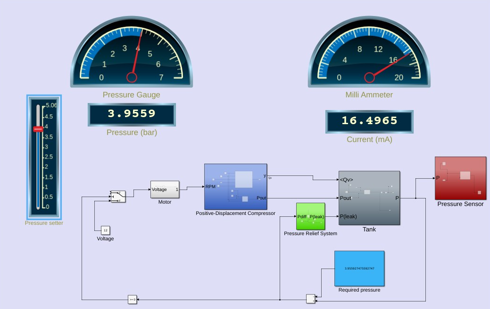

# Pneumatic Pressure Measurement & Control System — MATLAB Simulink

**RV College of Engineering | Dept. of Aerospace Engineering | Course: AS254IA (Aircraft Systems and Instrumentation)**

A block-diagram-level simulation of a complete pneumatic pressure generation, regulation, and monitoring chain — from electrical input voltage, through motor-driven positive-displacement compression, to tank pressure accumulation, safety relief logic, and industrial-standard 4–20 mA pressure sensing. Built in MATLAB Simulink under the model name `PneumaticsMain`.

*Complete Simulink model: pressure setter → motor → compressor → tank (with relief) → pressure sensor → gauge/ammeter display*

---

## Overview

Pneumatic systems are ubiquitous in industrial automation, but the pressure sensors and 4–20 mA current loops that instrument them are often taught as isolated concepts rather than as part of an integrated signal chain. This model closes that gap by simulating the entire path in one place:

**Voltage input → motor speed → compressor flow/pressure → tank pressure buildup → relief valve logic → pressure sensor → 4–20 mA current signal → gauge/ammeter display**

The system is intentionally simplified (ideal gas behavior, no thermodynamic losses, ideal linear sensor dynamics) to keep the model tractable for laboratory-level analysis while preserving the causal relationships between voltage, RPM, flow rate, pressure, and current that a real pneumatic instrumentation stack exhibits.

**Core specs modeled:**
- Positive-displacement compressor sized from piston geometry (not a black-box flow source)
- Pressure relief threshold: **10 bar**
- Industrial-standard pressure transmitter output: **4–20 mA**
- On–off (bang-bang) motor control with hysteresis, driven by pressure feedback

---
 
## 🙋 My Contribution
 
While this was submitted as a 4-person team lab project, I independently designed, modeled, and validated the **complete system end-to-end** — all five subsystems below:
 
| Area | What I Did |
|---|---|
| ⚡ **Motor Subsystem** | Modeled the DC motor's voltage-to-RPM relationship and the pressure-feedback-driven bang-bang switching logic (comparator + hysteresis) |
| 🌀 **Compressor Subsystem** | Modeled the positive-displacement compressor from first-principles piston geometry — swept volume, volumetric efficiency, and discharge pressure — as parameterized MATLAB Function blocks rather than a lookup table |
| 🛢️ **Tank Subsystem** | Modeled pressure accumulation as a first-order ODE, integrated over time, with careful initialization of the integrator's state |
| 🛡️ **Pressure Relief System** | Implemented the comparator-driven relief logic that vents excess pressure above the setpoint without introducing oscillation |
| 📟 **Sensing & Signal Conditioning** | Implemented the linear pressure-to-4–20mA current mapping and validated it against three operating points |
 
### Skills Learnt
 

 
- First-principles modeling of a reciprocating (positive-displacement) compressor from piston geometry, rather than treating it as a black-box flow source
- Implementing bang-bang control with hysteresis in Simulink, and why it avoids switching chatter without needing PID tuning
- Modeling pressure accumulation as an integrated first-order ODE, including correct integrator initialization
- Implementing industrial-standard 4–20 mA signal conditioning and validating the linear mapping across multiple operating points
- Keeping unit consistency across electrical, mechanical, and pneumatic domains feeding into one continuous model, and verifying each subsystem independently before full integration
---

## System Architecture

The model is organized into three functional stages, each implemented as its own Simulink subsystem:

| Stage | Subsystem | Function |
|---|---|---|
| 1. Generation | Electrical Power Supply & Drive → Positive-Displacement Compressor | Converts input voltage to motor RPM, then to volumetric air flow and discharge pressure |
| 2. Storage & Safety | Tank (Air Storage) → Pressure Relief System | Integrates net pressure rise over time; vents excess pressure above threshold |
| 3. Sensing & Display | Pressure Sensing & Signal Conditioning | Converts tank pressure to a 4–20 mA current signal; drives gauge/ammeter displays |

---

## Subsystem 1 — Electrical Power Supply & Motor Drive

*Motor sub-block: voltage input scaled by the motor velocity constant to produce RPM*

A DC voltage source (12V nominal, 6V used for the reported simulation run) supplies the motor through a **switching block** governed by pressure feedback — a comparator on tank pressure vs. the setpoint opens the switch (cutting motor power) once pressure reaches the upper threshold, and re-closes it once pressure drops below a lower threshold or a higher setpoint is requested. This is a classic **bang-bang control with hysteresis**: no PID tuning required, and it naturally avoids chatter from rapid switching.

The motor itself is modeled as a simplified linear speed relationship — electrical transients and losses are neglected so the model stays focused on pressure dynamics:

$$\omega = K_v \cdot V$$

| Symbol | Meaning | Value |
|---|---|---|
| $\omega$ | Motor angular velocity (RPM) | — |
| $V$ | Applied DC voltage | 12 V (6 V in reported run) |
| $K_v$ | Motor velocity constant | 250 RPM/V |

Motor output speed feeds directly into the compressor subsystem as its mechanical input.

---

## Subsystem 2 — Positive-Displacement Compressor

*Volume Flow-Rate Function and Output Pressure Function, implemented as parameterized MATLAB Function blocks*

Models a single-cylinder (configurable to multi-cylinder) reciprocating compressor, converting RPM into volumetric flow rate and discharge pressure from first-principles piston geometry — not a lookup table.

### Geometric & operating parameters

| Parameter | Symbol | Value |
|---|---|---|
| Piston radius | $r$ | 2 cm |
| Stroke length | $L$ | 5 cm |
| Number of cylinders | $N$ | 1 |
| Volumetric efficiency | $\eta_{eff}$ | 75% |
| Clearance length | $L_c$ | 1 cm |
| Inlet pressure | $P_{in}$ | 1.013 bar |

### Volumetric flow rate

Piston cross-sectional area:
$$A = \pi r^2$$

Swept volume per stroke:
$$V = A \cdot L$$

Volumetric flow rate delivered:
$$Q_v = \frac{V \cdot N \cdot RPM}{60} \cdot \frac{\eta_{eff}}{100} \cdot \frac{1}{1000}$$

($Q_v$ in m³/s; the /60 converts RPM to rev/s, the final factor handles unit scaling to m³.)

### Output pressure

Clearance volume:
$$V_c = \pi r^2 L_c$$

Swept volume:
$$V = \pi r^2 L$$

Discharge pressure (idealized volumetric compression):
$$P_{out} = P_{in} \cdot \frac{V}{V_c}$$

**Outputs:** $Q_v$ (volumetric flow rate) and $P_{out}$ (discharge pressure), both passed downstream to the tank subsystem.

---

## Subsystem 3 — Tank (Air Storage System)

*Pressure-rate MATLAB Function block, summing junction for leakage/relief, and integrator (1/s) producing instantaneous tank pressure*

Models pressure accumulation as a first-order differential equation, integrated over time.

**Inputs:** compressor discharge pressure ($P_{out}$), volumetric flow rate ($Q_v$), pressure leakage/relief rate ($P_{leak}$)
**Output:** instantaneous tank pressure ($P$)

Pressure rise rate:
$$P_{rate} = \frac{dP}{dt} = \frac{P_{in}}{V_t} \cdot Q_v$$

Net pressure rate, after subtracting relief/leakage:
$$\frac{dP}{dt} = P_{rate} - P_{leak}$$

Integrated to obtain instantaneous tank pressure:
$$P(t) = \int \frac{dP}{dt}\,dt$$

The integrator's initial condition is set to atmospheric pressure at simulation start — this is one of the few state variables in the model, so its initialization was handled carefully during integration testing.

---

## Subsystem 4 — Pressure Relief System

*Comparator-driven switch: outputs a fixed pressure-drop rate when tank pressure exceeds the required setpoint, zero otherwise*

Prevents overpressurization by generating a controlled pressure leakage signal whenever tank pressure exceeds the required setpoint. Activated only during excess-pressure conditions — no unnecessary pressure loss during normal operation.

Pressure difference signal:
$$P_{diff} = P_{req} - P$$

Switching logic (comparator on sign of $P_{diff}$):

| Condition | Action |
|---|---|
| $P_{diff} < 0$ (tank pressure exceeds setpoint) | Switch outputs a fixed pressure-drop rate → relief active |
| $P_{diff} \geq 0$ (tank pressure within limit) | Switch outputs zero → no relief action |

The pressure-drop rate is a constant that stands in for a real relief valve's/venting mechanism's discharge characteristic. Output ($P_{leak}$) feeds back into the tank subsystem's net pressure-rate summation.

---

## Subsystem 5 — Pressure Sensing & Signal Conditioning

*Ideal pressure transducer feeding a linear pressure-to-current MATLAB Function block, driving both bar and mA displays*

Converts the physical tank pressure into a standardized 4–20 mA current loop signal — the dominant analog transmission format in industrial instrumentation, chosen for its noise immunity over long cable runs and built-in fault detection (any reading below 4 mA implies broken wiring, sensor failure, or power loss).

Linear pressure-to-current mapping:

$$I = I_{low} + \left(\frac{I_{high} - I_{low}}{P_{high} - P_{low}}\right) P$$

Where $I$ is output current (mA) and $P$ is measured pressure (bar), scaled so 4 mA corresponds to zero pressure and 20 mA to the maximum rated pressure.

Output is displayed in real time via a pressure gauge + digital bar readout, and a milliammeter + digital mA readout.

---

## Implementation

**Model name:** `PneumaticsMain`
**Solver:** Continuous-time, default step size (suited to gradual pressure dynamics and steady-state capture)

### Initial conditions & parameters used in the reported run

| Parameter | Value |
|---|---|
| Initial tank pressure | Atmospheric |
| Supply voltage | 6 V |
| Motor velocity constant | 250 RPM/V |
| Pressure relief threshold | 10 bar |
| Sensor output range | 4–20 mA |

Each subsystem was developed and verified independently before interconnection, with particular attention paid to unit consistency across the electrical/mechanical/pneumatic domains and to correct initialization of the tank integrator's state.

---

## Results

### Compressor flow rate dynamics

*Blue trace: flow input signal; yellow: tank volume reference; orange: atmospheric pressure reference — showing the on/off switching behavior driven by the relief/control logic*

### Tank pressure build-up & relief valve action

*Tank pressure P vs. time — smooth build-up from atmospheric conditions, stabilization once the pressure relief threshold engages*

Tank pressure rises smoothly once the compressor is energized, at a rate set by motor speed and compressor airflow. When the pressure approaches the relief threshold, the relief system engages and pressure stabilizes rather than continuing to climb — confirming the bang-bang + relief-valve logic holds the system within its safe operating envelope without oscillation or instability.

### Pressure-to-current conversion

*Sensor current output vs. time, tracking tank pressure with a linear 4–20 mA relationship*

The current output tracks tank pressure linearly and proportionally — confirming correct implementation of the 4–20 mA signal-conditioning equation.

### Gauge/ammeter readouts at three operating points

*Mid-run snapshot: 3.9559 bar → 16.4965 mA*

| Tank pressure | Sensor current |
|---|---|
| 0 bar | 4 mA |
| 3.9559 bar | 16.4965 mA |
| 5.0650 bar | 20 mA |

These three snapshots (see `media/gauge-readings-*.png`) confirm the linear current mapping holds consistently across the operating range, not just asymptotically at the extremes.

---

## Assumptions & Limitations

The model trades physical fidelity for clarity and computational simplicity — appropriate for its educational/laboratory-analysis purpose, but worth flagging explicitly:

- Air modeled as an ideal gas; isothermal behavior assumed
- Compressor dynamics (torque ripple, valve delay) neglected
- Piping flow losses ignored except through the modeled relief path
- Tank pressure assumed spatially uniform
- Sensor dynamics assumed ideal and perfectly linear
- Relief mechanism modeled as functional switching logic, not physical valve mechanics
- Motor electrical dynamics (inductance, back-EMF transients) not modeled

---

## Tools & Methods

`MATLAB` `Simulink` `Simscape` `MATLAB Function Blocks` `Block-diagram Modeling`

---

## Team

Lab project carried out by a 4-person team in the Department of Aerospace Engineering, RV College of Engineering (Academic Year 2025–2026), under the guidance of Gp. Capt. Deepak Bana VSM (Retd.), Visiting Professor — as part of Course AS254IA, Aircraft Systems and Instrumentation.
